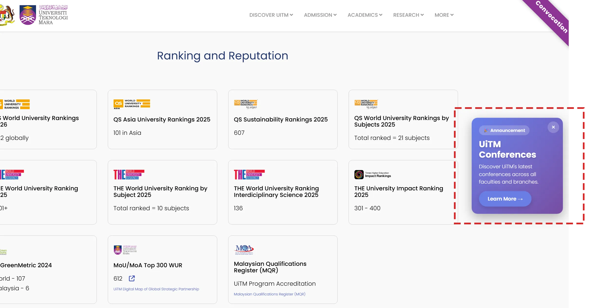

# Floating Advertisement



_Floating Advertisement_ ini boleh digunakan sebagai visual promosi kepada sesuatu peristiwa. _Floating Advertisement_ ini akan terapung dibahagian kanan laman web. Untuk mencipta _Floating Advertisement_ seperti diatas, ikuti langkah berikut:

<ol>
    <li>Nyah aktif Default Editor</li>
        <ol type="a">
            <li>System - Global Configuration</li>
            <li>Site - Default Editor - None (Sekiranya tidak tukar, TinyMCE Editor adalah WYSIWYG Editor dan kod HTML dan CSS tidak akan berfungsi)</li>
            <li>Save and Close</li>
        </ol>
    <li>Content - Site Module</li>
    <li>New - Custom</li>
    <li>Title - Advertisement</li>
    <li>Title - Hide</li>
    <li>Position - footer2</li>
    <li>Salin dan tampal kod dibawah</li>
    <li>Save and Close</li>
</ol>

> Jangan lupa untuk pastikan anda memilih menu yang diperlukan untuk paparan modul ini di **Menu Assignment**

```html
<style>
  /* Advertisement container */
  .promo-ad-container {
    position: fixed !important;
    right: 20px !important;
    top: 50% !important;
    transform: translateY(-50%) !important;
    z-index: 999999 !important;
    display: block !important;
    visibility: visible !important;
    animation: fadeIn 1.5s ease-in !important;
  }

  /* Fade in animation */
  @keyframes fadeIn {
    0% {
      opacity: 0;
    }
    100% {
      opacity: 1;
    }
  }

  /* Advertisement card */
  .promo-ad-card {
    width: 250px;
    background: linear-gradient(135deg, #667eea 0%, #764ba2 100%);
    border-radius: 16px;
    box-shadow: 0 10px 30px rgba(0, 0, 0, 0.3);
    color: white;
    overflow: hidden;
    position: relative;
  }

  /* Animated background effect */
  .promo-ad-card::before {
    content: "";
    position: absolute;
    top: -50%;
    right: -50%;
    width: 200%;
    height: 200%;
    background: radial-gradient(
      circle,
      rgba(255, 255, 255, 0.1) 0%,
      transparent 70%
    );
    animation: pulse 3s ease-in-out infinite;
  }

  @keyframes pulse {
    0%,
    100% {
      transform: scale(1);
      opacity: 0.5;
    }
    50% {
      transform: scale(1.1);
      opacity: 0.8;
    }
  }

  /* Content area */
  .promo-ad-content {
    padding: 20px;
    position: relative;
    z-index: 1;
  }

  .promo-ad-badge {
    display: inline-block;
    background-color: rgba(255, 255, 255, 0.2);
    padding: 4px 12px;
    border-radius: 20px;
    font-size: 12px;
    font-weight: 600;
    margin-bottom: 10px;
    backdrop-filter: blur(10px);
  }

  .promo-ad-card h2 {
    color: white !important;
    font-size: 24px !important;
    font-weight: 700 !important;
    margin: 0 0 8px 0 !important;
    text-shadow: 0 2px 4px rgba(0, 0, 0, 0.2);
  }

  .promo-ad-card p {
    color: white !important;
    font-size: 14px !important;
    line-height: 1.5 !important;
    opacity: 0.95;
    margin: 0 0 15px 0 !important;
  }

  .promo-ad-button {
    display: inline-block;
    background-color: #6b7ee5;
    color: #667eea;
    padding: 10px 24px;
    border-radius: 25px;
    text-decoration: none;
    font-weight: 600;
    font-size: 14px;
    transition: all 0.3s ease;
    box-shadow: 0 4px 12px rgba(0, 0, 0, 0.15);
    border: none;
    cursor: pointer;
  }

  .promo-ad-button:hover {
    transform: translateY(-2px);
    box-shadow: 0 6px 20px rgba(0, 0, 0, 0.25);
    color: #764ba2;
    text-decoration: none;
  }

  /* Close button */
  .promo-ad-close {
    position: absolute;
    top: 10px;
    right: 10px;
    background: rgba(255, 255, 255, 0.2);
    border: none;
    color: white;
    width: 32px;
    height: 32px;
    border-radius: 50%;
    cursor: pointer;
    font-size: 18px;
    line-height: 1;
    transition: all 0.3s ease;
    backdrop-filter: blur(10px);
    z-index: 2;
  }

  .promo-ad-close:hover {
    background: rgba(255, 255, 255, 0.3);
    transform: rotate(90deg);
  }

  /* Optional ad image */
  .promo-ad-image {
    width: 100%;
    height: 160px;
    object-fit: cover;
    border-top: 1px solid rgba(255, 255, 255, 0.1);
  }

  /* Responsive */
  @media (max-width: 768px) {
    .promo-ad-container {
      right: 10px !important;
    }

    .promo-ad-card {
      width: calc(100vw - 20px);
      max-width: 320px;
    }
  }

  /* Hide animation */
  .promo-ad-container.hidden {
    animation: fadeOut 0.5s ease-out forwards !important;
  }

  @keyframes fadeOut {
    0% {
      opacity: 1;
    }
    100% {
      opacity: 0;
    }
  }
</style>

<!-- Advertisement Container -->
<div class="promo-ad-container" id="promoAdContainer">
  <div class="promo-ad-card">
    <!-- Close Button -->
    <button
      class="promo-ad-close"
      onclick="closePromoAd()"
      aria-label="Close advertisement"
    >
      ×
    </button>

    <!-- Ad Content -->
    <div class="promo-ad-content">
      <span class="promo-ad-badge">🎉 Announcement</span>
      <h2>UiTM Conferences</h2>
      <p>
        Discover UiTM's latest conferences across all faculties and branches.
      </p>
      <a href="#" class="promo-ad-button" onclick="handlePromoAdClick(event)">
        Learn More →
      </a>
    </div>

    <!-- Optional Ad Image - Uncomment and add your image URL -->
    <!--  -->
  </div>
</div>

<script>
  // Close advertisement
  function closePromoAd() {
    var adContainer = document.getElementById("promoAdContainer");
    if (adContainer) {
      adContainer.classList.add("hidden");
      setTimeout(function () {
        adContainer.style.display = "none";
      }, 500);
    }
  }

  // Handle ad click
  function handlePromoAdClick(event) {
    event.preventDefault();

    // Option 1: Redirect to promotion page
    // window.location.href = '/your-promotion-page';

    // Option 2: Open in new tab
    // window.open('/your-promotion-page', '_blank');

    // Option 3: Show alert (remove this in production)
    alert("Thank you for your interest!");
  }

  // Optional: Auto-close after 10 seconds (uncomment if needed)
  // setTimeout(function() {
  //     closePromoAd();
  // }, 10000);
</script>
```
