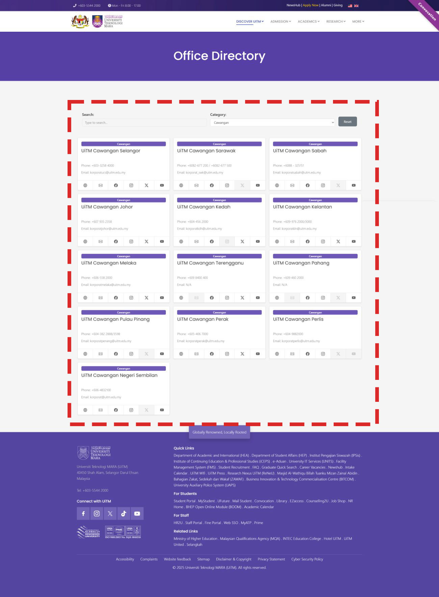

# Office Directory



_Office Directory_ merupakan merupakan senarai pejabat yang dipaparkan dalam bentuk kotak dan mempunyai fungsi carian berdasarkan katakunci. Untuk mencipta _Office Directory_ seperti diatas, ikuti langkah berikut:

<ol>
    <li>Nyah aktif Default Editor</li>
        <ol type="a">
            <li>System - Global Configuration</li>
            <li>Site - Default Editor - None (Sekiranya tidak tukar, TinyMCE Editor adalah WYSIWYG Editor dan kod HTML dan CSS tidak akan berfungsi)</li>
            <li>Save and Close</li>
        </ol>
    <li>Components - SP Page Builder Pro - Pages</li>
    <li>Pilih page anda</li>
    <li>Add Element - Raw HTML</li>
    <li>Masuk kan kod dibawah dibahagian HTML Code</li>
    <li>Save</li>
</ol>

```html
text/x-generic uitm_directory.php ( HTML document, ASCII text, with CRLF line
terminators )
<!-- Bootstrap Icons -->
<link
  rel="stylesheet"
  href="https://cdn.jsdelivr.net/npm/bootstrap-icons@1.11.1/font/bootstrap-icons.css"
/>

<script>
  const data = {
    Cawangan: [
      {
        title_bm: "UiTM Cawangan Selangor",
        title_en: "",
        phone: "+603-3258 4000",
        website: "https://selangor.uitm.edu.my",
        email: "korporatucs@uitm.edu.my",
        facebook: "https://www.facebook.com/halamanuitmcawanganselangor",
        instagram: "https://www.instagram.com/uitmselangor.official/",
        x: "https://x.com/uitm_selangor",
        youtube: "https://www.youtube.com/channel/UClvhc2YLFUdtG5kVZ34CdCQ",
      },
      {
        title_bm: "UiTM Cawangan Sarawak",
        title_en: "",
        phone: "+6082-677 200 / +6082-677 500",
        website: "https://sarawak.uitm.edu.my",
        email: "korporat_swk@uitm.edu.my",
        facebook: "https://www.facebook.com/uitm.sarawak",
        instagram: "https://www.instagram.com/uitmsarawak_official/",
        x: "",
        youtube: "https://www.youtube.com/channel/UCuUhVD_fUwkbzum3CNQtZvQ",
      },
      {
        title_bm: "UiTM Cawangan Sabah",
        title_en: "",
        phone: "+6088 - 325151",
        website: "https://sabah.uitm.edu.my",
        email: "korporatsabah@uitm.edu.my",
        facebook: "https://www.facebook.com/UiTMCawanganSabah",
        instagram: "https://www.instagram.com/uitm_sabah.official/",
        x: "",
        youtube: "https://www.youtube.com/channel/UCr1vnTghkutFtcPW3LQEBGQ",
      },
      {
        title_bm: "UiTM Cawangan Johor",
        title_en: "",
        phone: "+607 935 2358",
        website: "https://johor.uitm.edu.my",
        email: "korporatjohor@uitm.edu.my",
        facebook: "https://www.facebook.com/uitmjohorofficial",
        instagram: "https://www.instagram.com/rektoruitmjohor/?hl=en",
        x: "https://twitter.com/uitmjohor",
        youtube: "https://www.youtube.com/c/UiTMJohorOfficial/featured",
      },
      {
        title_bm: "UiTM Cawangan Kedah",
        title_en: "",
        phone: "+604-456 2000",
        website: "https://kedah.uitm.edu.my",
        email: "korporatkdh@uitm.edu.my",
        facebook: "https://www.facebook.com/UiTMSPMerbok",
        instagram: "",
        x: "https://twitter.com/uitm_kedah",
        youtube: "https://www.youtube.com/channel/UCmrIETHsfntEscr8ZKwhr3A",
      },
      {
        title_bm: "UiTM Cawangan Kelantan",
        title_en: "",
        phone: "+609-976 2000/3000",
        website: "https://kelantan.uitm.edu.my",
        email: "korporatkln@uitm.edu.my",
        facebook: "https://www.facebook.com/UiTMCaw.Kelantan",
        instagram: "https://instagram.com/uitmcawangankelantan",
        x: "https://twitter.com/UiTMCK",
        youtube: "https://www.youtube.com/channel/UCzfhGDvh9JIDyB2fPJ51trw",
      },
      {
        title_bm: "UiTM Cawangan Melaka",
        title_en: "",
        phone: "+606-558 2000",
        website: "https://melaka.uitm.edu.my",
        email: "korporatmelaka@uitm.edu.my",
        facebook: "https://www.facebook.com/uitmcmrasmi",
        instagram: "https://www.instagram.com/uitmcmelaka",
        x: "https://twitter.com/uitmcmelaka",
        youtube: "https://www.youtube.com/@UiTMCawanganMelakaYoutubeRasmi",
      },
      {
        title_bm: "UiTM Cawangan Terengganu",
        title_en: "",
        phone: "+609 8400 400",
        website: "https://terengganu.uitm.edu.my",
        email: "",
        facebook: "https://www.facebook.com/RektorUitmTerengganu/",
        instagram: "https://instagram.com/uitm_terengganu",
        x: "https://twitter.com/uitm_terengganu",
        youtube: "https://www.youtube.com/@StudioUiTMTerengganu",
      },
      {
        title_bm: "UiTM Cawangan Pahang",
        title_en: "",
        phone: "+609 460 2000",
        website: "https://pahang.uitm.edu.my",
        email: "",
        facebook: "https://www.facebook.com/kampuskhazanahalam",
        instagram: "https://www.instagram.com/uitm_caw_pahang/",
        x: "",
        youtube: "https://www.youtube.com/channel/UCUgvnkeRY2MoSVj_XxxKTdg",
      },
      {
        title_bm: "UiTM Cawangan Pulau Pinang",
        title_en: "",
        phone: "+604-382 2888/3598",
        website: "https://penang.uitm.edu.my",
        email: "korporatpenang@uitm.edu.my",
        facebook: "https://www.facebook.com/UiTMCPP",
        instagram: "https://www.instagram.com/uitmcpp_official",
        x: "",
        youtube: "https://www.youtube.com/@uitmcppchannel929",
      },
      {
        title_bm: "UiTM Cawangan Perak",
        title_en: "",
        phone: "+605-406 7000",
        website: "https://perak.uitm.edu.my",
        email: "korporatperak@uitm.edu.my",
        facebook: "https://www.facebook.com/uitmperakofficial",
        instagram: "https://www.instagram.com/uitmperakofficial/",
        x: "https://twitter.com/UiTMPerak",
        youtube: "https://www.youtube.com/@UiTMPerakChannel",
      },
      {
        title_bm: "UiTM Cawangan Perlis",
        title_en: "",
        phone: "+604-9882000",
        website: "https://perlis.uitm.edu.my",
        email: "korporatperlis@uitm.edu.my",
        facebook: "https://www.facebook.com/profile.php?id=100063470299516",
        instagram: "https://www.instagram.com/uitmperlis.official/",
        x: "",
        youtube: "",
      },
      {
        title_bm: "UiTM Cawangan Negeri Sembilan",
        title_en: "",
        phone: "+606-4832100",
        website: "https://nsembilan.uitm.edu.my",
        email: "korporat@uitm.edu.my",
        facebook: "https://www.facebook.com/UiTMN9",
        instagram: "https://www.instagram.com/uitmkampusseremban/",
        x: "",
        youtube: "https://www.youtube.com/@korporatuitmcns5410",
      },
    ],

    Jabatan_Canseleri: [
      {
        title_bm: "Pejabat Naib Canselor",
        title_en: "Office of the Vice-Chancellor",
        phone: "+603-5544 2000",
        fax: "+603-5544 2223",
        website: "https://vc.uitm.edu.my/",
        email: "vc@uitm.edu.my",
        facebook: "https://www.facebook.com/VCUiTM/",
        instagram: "",
        x: "",
        youtube: "",
      },
      {
        title_bm:
          "Bahagian Pentadbiran Strategik dan Sumber Manusia Jabatan Canseleri",
        title_en: "",
        phone: "03-5544 2727",
        fax: "",
        website: "https://canseleri.uitm.edu.my/",
        email: "canseleri@uitm.edu.my",
        facebook: "",
        instagram: "",
        x: "",
        youtube: "",
      },
      {
        title_bm: "Pejabat Transformasi Universiti",
        title_en: "",
        phone: "+603-5544 2525",
        fax: "",
        website: "https://btu.uitm.edu.my/",
        email: "btu@uitm.edu.my",
        facebook: "https://www.facebook.com/UiTM2025/",
        instagram: "https://www.instagram.com/p/B2QTSvyAL4M/?hl=en",
        x: "https://twitter.com/cspi_uitm",
        youtube: "https://www.youtube.com/channel/UCChxnVBqY2d_g3Lzs_ocJqg",
      },
      {
        title_bm: "Pejabat Komunikasi Strategik",
        title_en: "",
        phone: "+603 -55442102",
        fax: "",
        website: "https://korporat.uitm.edu.my/",
        email: "bkk@uitm.edu.my",
        facebook: "https://www.facebook.com/darilensakorporat",
        instagram: "",
        x: "",
        youtube: "https://www.youtube.com/@uitmchannel",
      },
      {
        title_bm: "Pejabat Pemerkasaan Adiwangsa",
        title_en: "",
        phone: "03-5544 3802 / 3805",
        fax: "03-5544 3799",
        website: "https://impakuitm.uitm.edu.my/",
        email: "",
        facebook: "https://www.facebook.com/impakmediarasmi",
        instagram: "https://www.instagram.com/impakuitm/",
        x: "",
        youtube: "",
      },
      {
        title_bm: "Penyandang Kursi Institusi Raja-Raja Melayu",
        title_en: "",
        phone: "03-5544 4114/ 4154/ 4047",
        fax: "",
        website: "https://kursirajamelayu.uitm.edu.my/",
        email: "kursirajamelayu@uitm.edu.my",
        facebook: "https://www.facebook.com/uitm.kirrm",
        instagram: "https://www.instagram.com/uitm_kursirajamelayu/",
        x: "https://twitter.com/uitm_KIRRM",
        youtube: "",
      },
      {
        title_bm: "Bahagian Hal Ehwal Islam",
        title_en: "",
        phone: "03-55442350",
        fax: "",
        website: "https://masjiduitm.uitm.edu.my/",
        email: "bhei@uitm.edu.my",
        facebook: "https://www.facebook.com/MasjidUiTMShahAlam",
        instagram: "",
        x: "",
        youtube: "https://www.youtube.com/channel/UCG5l3vrBy5pGLO8d16Cad4Q",
      },
      {
        title_bm: "Bahagian Zakat, Sedekah dan Wakaf (ZAWAF)",
        title_en: "",
        phone: "03-5544 3115",
        fax: "",
        website: "https://zawaf.uitm.edu.my/",
        email: "bzsw@uitm.edu.my",
        facebook: "https://facebook.com/bzswUiTM",
        instagram: "https://instagram.com/zawafuitm?igshid=YmMyMTA2M2Y=",
        x: "https://twitter.com/ZakatDan?s=20&t=Z9H2NfrSpPnHupixO7hAQQ",
        youtube: "",
      },
      {
        title_bm: "Institut Pemikiran dan Kepimpinan Melayu (IMPAK)",
        title_en: "",
        phone: "03-5544 3802 / 3805",
        fax: "03-5544 3799",
        website: "https://impakuitm.uitm.edu.my/",
        email: "",
        facebook: "https://www.facebook.com/impakmediarasmi",
        instagram: "https://www.instagram.com/impakuitm/",
        x: "",
        youtube: "",
      },
      {
        title_bm: "Institut Kualiti dan Pengembangan Ilmu (InQKA)",
        title_en: "",
        phone: "+603-5543 5702",
        fax: "",
        website: "https://inqka.uitm.edu.my/",
        email: "inqka@uitm.edu.my",
        facebook: "https://www.facebook.com/inqka/",
        instagram: "https://www.instagram.com/inqkauitm/?hl=en",
        x: "https://twitter.com/inqka_uitm",
        youtube: "https://www.youtube.com/channel/UCeqoVG7HxSygEcgxWqrtoFg",
      },
      {
        title_bm: "Institut Kepimpinan dan Pembangunan (ILD)",
        title_en: "",
        phone: "+06-7580 200",
        fax: "",
        website: "https://ild.uitm.edu.my/",
        email: "",
        facebook: "https://www.facebook.com/ILDUiTM",
        instagram: "https://www.instagram.com/uitm.official/",
        x: "https://twitter.com/uitmofficial",
        youtube: "https://www.youtube.com/@ildenstek",
      },
      {
        title_bm: "Hospital Al-Sultan Abdullah",
        title_en: "",
        phone: "03-3396 3000",
        fax: "",
        website: "https://hospital.uitm.edu.my/",
        email: "huitm.unitkorporat@uitm.edu.my",
        facebook: "https://www.facebook.com/HospitalUiTMOfficial/",
        instagram: "https://www.instagram.com/hasauitmofficial/",
        x: "https://twitter.com/hasauitm",
        youtube: "https://www.youtube.com/channel/UC58cGN2WUeCjO9m37DVoywA",
      },
      {
        title_bm: "Bahagian Perkhidmatan dan Pembangunan OKU",
        title_en:
          "Unit for Disabled Students' Development and Services (U-DSERVED)",
        phone: "+603-5544 2525",
        fax: "",
        website: "https://u-dserved.uitm.edu.my/",
        email: "u-dserved@uitm.edu.my",
        facebook: "https://www.facebook.com/profile.php?id=100064268763038",
        instagram: "https://www.instagram.com/upo.uitm/?igshid=NDk5N2NlZjQ%3D",
        x: "",
        youtube: "https://www.youtube.com/@unitperkhidmatanokuuitm4016",
      },
      {
        title_bm: "Pasukan Latihan Pegawai Simpanan (PALAPES)",
        title_en: "",
        phone: "603-5544 3676",
        fax: "",
        website: "https://palapes.uitm.edu.my/",
        email: "palapes@uitm.edu.my",
        facebook: "https://www.facebook.com/PPIIUiTM",
        instagram: "",
        x: "",
        youtube: "",
      },
      {
        title_bm: "Pusat Pengurusan Risiko",
        title_en: "",
        phone: "+603-55442555/ 55442177 / 55442556 / 55442559",
        fax: "",
        website: "https://ppr.uitm.edu.my/",
        email: "pprisk@uitm.edu.my",
        facebook: "",
        instagram: "",
        x: "",
        youtube: "",
      },
      {
        title_bm: "Bahagian Audit Dalam",
        title_en: "",
        phone: "03-5544 2122",
        fax: "",
        website: "https://auditdalam.uitm.edu.my/",
        email: "audituitm@uitm.edu.my",
        facebook: "",
        instagram: "",
        x: "",
        youtube: "",
      },
      {
        title_bm: "Bahagian Integriti",
        title_en: "",
        phone: "03-5544 3150",
        fax: "",
        website: "https://integriti.uitm.edu.my/",
        email: "bahagianintegriti@uitm.edu.my",
        facebook: "",
        instagram: "",
        x: "",
        youtube: "",
      },
    ],
    Jabatan_Akademik_dan_Antarabangsa: [
      {
        title_bm: "Pejabat Timbalan Naib Canselor (Akademik dan Antarabangsa)",
        title_en: "",
        phone: "03-55442233",
        fax: "",
        website: "https://hea.uitm.edu.my/",
        email: "jaa@uitm.edu.my",
        facebook: "https://www.facebook.com/HalEhwalAkademik/",
        instagram: "",
        x: "",
        youtube: "",
      },
      {
        title_bm:
          "Bahagian Pentadbiran Strategik dan Sumber Manusia Jabatan Akademik dan Antarabangsa",
        title_en: "",
        phone: "03-55443511",
        fax: "",
        website: "https://hea.uitm.edu.my/",
        email: "jaa@uitm.edu.my",
        facebook: "https://www.facebook.com/HalEhwalAkademik/",
        instagram: "",
        x: "",
        youtube: "",
      },
      {
        title_bm: "UiTM Global",
        title_en: "",
        phone: "03-5544 2042",
        fax: "",
        website: "https://uitmglobal.uitm.edu.my/",
        email: "global@uitm.edu.my",
        facebook: "https://www.facebook.com/ug.uitm/",
        instagram: "https://www.instagram.com/uitmglobal",
        x: "",
        youtube: "https://www.youtube.com/@UGLAMxDIA",
      },
      {
        title_bm: "Bahagian Pembangunan Akademik",
        title_en: "",
        phone: "",
        fax: "",
        website: "",
        email: "",
        facebook: "",
        instagram: "",
        x: "",
        youtube: "",
      },
      {
        title_bm: "Bahagian Hal Ehwal Kurikulum",
        title_en: "",
        phone: "",
        fax: "",
        website: "",
        email: "",
        facebook: "",
        instagram: "",
        x: "",
        youtube: "",
      },
      {
        title_bm: "Bahagian Pentaksiran dan Penilaian Akademik",
        title_en: "",
        phone: "",
        fax: "",
        website: "",
        email: "",
        facebook: "",
        instagram: "",
        x: "",
        youtube: "",
      },
      {
        title_bm: "Bahagian Pengambilan Pelajar",
        title_en: "",
        phone: "",
        fax: "",
        website: "",
        email: "",
        facebook: "",
        instagram: "",
        x: "",
        youtube: "",
      },
      {
        title_bm: "Pusat Asasi",
        title_en: "",
        phone: "",
        fax: "",
        website: "",
        email: "",
        facebook: "",
        instagram: "",
        x: "",
        youtube: "",
      },
      {
        title_bm:
          "Institut Pendidikan Berterusan dan Pengajian Profesional (iCEPS)",
        title_en: "",
        phone: "",
        fax: "",
        website: "",
        email: "",
        facebook: "",
        instagram: "",
        x: "",
        youtube: "",
      },
      {
        title_bm: "Institut Pengajian Siswazah (iPSIS)",
        title_en: "",
        phone: "",
        fax: "",
        website: "",
        email: "",
        facebook: "",
        instagram: "",
        x: "",
        youtube: "",
      },
    ],
    Jabatan_Hal_Ehwal_Pelajar: [
      {
        title_bm: "Pejabat Timbalan Naib Canselor (Hal Ehwal Pelajar)",
        title_en: "",
        phone: "",
        fax: "",
        website: "",
        email: "",
        facebook: "",
        instagram: "",
        x: "",
        youtube: "",
      },
      {
        title_bm:
          "Bahagian Pentadbiran Strategik dan Sumber Manusia Jabatan Hal Ehwal Pelajar",
        title_en: "",
        phone: "",
        fax: "",
        website: "",
        email: "",
        facebook: "",
        instagram: "",
        x: "",
        youtube: "",
      },
      {
        title_bm: "Akademi Pembangunan PKS dan Keusahawanan Malaysia",
        title_en: "",
        phone: "",
        fax: "",
        website: "",
        email: "",
        facebook: "",
        instagram: "",
        x: "",
        youtube: "",
      },
      {
        title_bm: "Pusat Pembangunan Pelajar",
        title_en: "",
        phone: "",
        fax: "",
        website: "",
        email: "",
        facebook: "",
        instagram: "",
        x: "",
        youtube: "",
      },
      {
        title_bm: "Pusat Kebudayaan",
        title_en: "",
        phone: "",
        fax: "",
        website: "",
        email: "",
        facebook: "",
        instagram: "",
        x: "",
        youtube: "",
      },
      {
        title_bm: "Pusat Kesihatan",
        title_en: "",
        phone: "",
        fax: "",
        website: "",
        email: "",
        facebook: "",
        instagram: "",
        x: "",
        youtube: "",
      },
      {
        title_bm: "Pusat Kokurikulum",
        title_en: "",
        phone: "",
        fax: "",
        website: "",
        email: "",
        facebook: "",
        instagram: "",
        x: "",
        youtube: "",
      },
      {
        title_bm: "Pusat Sukan",
        title_en: "",
        phone: "",
        fax: "",
        website: "",
        email: "",
        facebook: "",
        instagram: "",
        x: "",
        youtube: "",
      },
      {
        title_bm: "Institut Kepimpinan Pelajar",
        title_en: "",
        phone: "",
        fax: "",
        website: "",
        email: "",
        facebook: "",
        instagram: "",
        x: "",
        youtube: "",
      },
      {
        title_bm: "Akademi Kepolisan UiTM-PDRM",
        title_en: "",
        phone: "",
        fax: "",
        website: "",
        email: "",
        facebook: "",
        instagram: "",
        x: "",
        youtube: "",
      },
      {
        title_bm: "Pusat Residensi dan Hospitaliti",
        title_en: "",
        phone: "",
        fax: "",
        website: "",
        email: "",
        facebook: "",
        instagram: "",
        x: "",
        youtube: "",
      },
      {
        title_bm: "Pusat Kerjaya dan Kaunseling",
        title_en: "",
        phone: "",
        fax: "",
        website: "",
        email: "",
        facebook: "",
        instagram: "",
        x: "",
        youtube: "",
      },
      {
        title_bm: "Unit Ruang Niaga",
        title_en: "",
        phone: "",
        fax: "",
        website: "",
        email: "",
        facebook: "",
        instagram: "",
        x: "",
        youtube: "",
      },
    ],
    Jabatan_Penyelidikan_dan_Inovasi: [
      {
        title_bm: "Pejabat Timbalan Naib Canselor (Penyelidikan dan Inovasi)",
        title_en: "",
        phone: "",
        fax: "",
        website: "",
        email: "",
        facebook: "",
        instagram: "",
        x: "",
        youtube: "",
      },
      {
        title_bm:
          "Bahagian Pentadbiran Strategik dan Sumber Manusia Jabatan Penyelidikan dan Inovasi",
        title_en: "",
        phone: "",
        fax: "",
        website: "",
        email: "",
        facebook: "",
        instagram: "",
        x: "",
        youtube: "",
      },
      {
        title_bm: "Pusat Pengurusan Penyelidikan",
        title_en: "",
        phone: "",
        fax: "",
        website: "",
        email: "",
        facebook: "",
        instagram: "",
        x: "",
        youtube: "",
      },
      {
        title_bm: "Neksus Penyelidikan UiTM",
        title_en: "",
        phone: "",
        fax: "",
        website: "",
        email: "",
        facebook: "",
        instagram: "",
        x: "",
        youtube: "",
      },
      {
        title_bm: "Business Innovation & Technology Commercialization",
        title_en: "",
        phone: "",
        fax: "",
        website: "",
        email: "",
        facebook: "",
        instagram: "",
        x: "",
        youtube: "",
      },
      {
        title_bm: "Penerbit UiTM",
        title_en: "",
        phone: "",
        fax: "",
        website: "",
        email: "",
        facebook: "",
        instagram: "",
        x: "",
        youtube: "",
      },
      {
        title_bm: "Pusat Perundingan UiTM",
        title_en: "",
        phone: "",
        fax: "",
        website: "",
        email: "",
        facebook: "",
        instagram: "",
        x: "",
        youtube: "",
      },
      {
        title_bm: "Unit Maklumat Strategik",
        title_en: "",
        phone: "",
        fax: "",
        website: "",
        email: "",
        facebook: "",
        instagram: "",
        x: "",
        youtube: "",
      },
      {
        title_bm: "Unit Komunikasi dan Ketampakan Penyelidikan",
        title_en: "",
        phone: "",
        fax: "",
        website: "",
        email: "",
        facebook: "",
        instagram: "",
        x: "",
        youtube: "",
      },
    ],
    Jabatan_Jaringan_Industri_Komuniti_dan_Alumni: [
      {
        title_bm:
          "Pejabat Timbalan Naib Canselor (Jaringan Industri, Komuniti dan Alumni)",
        title_en: "",
        phone: "",
        fax: "",
        website: "",
        email: "",
        facebook: "",
        instagram: "",
        x: "",
        youtube: "",
      },
      {
        title_bm:
          "Bahagian Pentadbiran Strategik dan Sumber Manusia Jabatan Jaringan Industri, Komuniti dan Alumni",
        title_en: "",
        phone: "",
        fax: "",
        website: "",
        email: "",
        facebook: "",
        instagram: "",
        x: "",
        youtube: "",
      },
      {
        title_bm: "Pusat Jaringan Industri dan Kerajaan",
        title_en: "",
        phone: "",
        fax: "",
        website: "",
        email: "",
        facebook: "",
        instagram: "",
        x: "",
        youtube: "",
      },
      {
        title_bm: "Pusat Jaringan Komuniti",
        title_en: "",
        phone: "",
        fax: "",
        website: "",
        email: "",
        facebook: "",
        instagram: "",
        x: "",
        youtube: "",
      },
      {
        title_bm: "Pusat Jaringan Alumni",
        title_en: "",
        phone: "",
        fax: "",
        website: "",
        email: "",
        facebook: "",
        instagram: "",
        x: "",
        youtube: "",
      },
      {
        title_bm: "Pusat Pembangunan Komuniti Lestari",
        title_en: "",
        phone: "",
        fax: "",
        website: "",
        email: "",
        facebook: "",
        instagram: "",
        x: "",
        youtube: "",
      },
      {
        title_bm: "Pusat Komunikasi ICAN",
        title_en: "",
        phone: "",
        fax: "",
        website: "",
        email: "",
        facebook: "",
        instagram: "",
        x: "",
        youtube: "",
      },
      {
        title_bm: "Unit Pemindahan Ilmu",
        title_en: "",
        phone: "",
        fax: "",
        website: "",
        email: "",
        facebook: "",
        instagram: "",
        x: "",
        youtube: "",
      },
    ],
    Jabatan_Pembangunan: [
      {
        title_bm: "Pejabat Timbalan Naib Canselor (Pembangunan)",
        title_en: "",
        phone: "",
        fax: "",
        website: "",
        email: "",
        facebook: "",
        instagram: "",
        x: "",
        youtube: "",
      },
      {
        title_bm: "Bahagian Pembangunan dan Infrastruktur",
        title_en: "",
        phone: "",
        fax: "",
        website: "",
        email: "",
        facebook: "",
        instagram: "",
        x: "",
        youtube: "",
      },
      {
        title_bm: "Bahagian Pengurusan PFI",
        title_en: "",
        phone: "",
        fax: "",
        website: "",
        email: "",
        facebook: "",
        instagram: "",
        x: "",
        youtube: "",
      },
      {
        title_bm: "Bahagian Pengurusan Fasiliti",
        title_en: "",
        phone: "",
        fax: "",
        website: "",
        email: "",
        facebook: "",
        instagram: "",
        x: "",
        youtube: "",
      },
      {
        title_bm: "Bahagian Pengurusan Kontrak dan Bajet",
        title_en: "",
        phone: "",
        fax: "",
        website: "",
        email: "",
        facebook: "",
        instagram: "",
        x: "",
        youtube: "",
      },
      {
        title_bm: "Bahagian Dasar, Kualiti dan Ukur Bangunan",
        title_en: "",
        phone: "",
        fax: "",
        website: "",
        email: "",
        facebook: "",
        instagram: "",
        x: "",
        youtube: "",
      },
      {
        title_bm: "Bahagian Keselamatan dan Kesihatan Pekerjaan",
        title_en: "",
        phone: "",
        fax: "",
        website: "",
        email: "",
        facebook: "",
        instagram: "",
        x: "",
        youtube: "",
      },
      {
        title_bm: "UiTM Green Centre",
        title_en: "",
        phone: "",
        fax: "",
        website: "",
        email: "",
        facebook: "",
        instagram: "",
        x: "",
        youtube: "",
      },
      {
        title_bm: "Bahagian Pengurusan Kenderaan",
        title_en: "",
        phone: "",
        fax: "",
        website: "",
        email: "",
        facebook: "",
        instagram: "",
        x: "",
        youtube: "",
      },
    ],
    Jabatan_Pendaftar: [
      {
        title_bm: "Pejabat Pendaftar",
        title_en: "",
        phone: "",
        fax: "",
        website: "",
        email: "",
        facebook: "",
        instagram: "",
        x: "",
        youtube: "",
      },
      {
        title_bm: "Bahagian Pengurusan Sumber Manusia",
        title_en: "",
        phone: "",
        fax: "",
        website: "",
        email: "",
        facebook: "",
        instagram: "",
        x: "",
        youtube: "",
      },
      {
        title_bm: "Bahagian Pentadbiran dan Sekretariat LPU",
        title_en: "",
        phone: "",
        fax: "",
        website: "",
        email: "",
        facebook: "",
        instagram: "",
        x: "",
        youtube: "",
      },
      {
        title_bm: "Bahagian Dasar dan Governan Universiti",
        title_en: "",
        phone: "",
        fax: "",
        website: "",
        email: "",
        facebook: "",
        instagram: "",
        x: "",
        youtube: "",
      },
      {
        title_bm: "Bahagian Rekod Pelajar dan Konvokesyen",
        title_en: "",
        phone: "",
        fax: "",
        website: "",
        email: "",
        facebook: "",
        instagram: "",
        x: "",
        youtube: "",
      },
      {
        title_bm:
          "Polis Bantuan lbu Pejabat Polis Bantuan (Bahagian Keselamatan)",
        title_en: "",
        phone: "",
        fax: "",
        website: "",
        email: "",
        facebook: "",
        instagram: "",
        x: "",
        youtube: "",
      },
    ],
    Jabatan_Bendahari: [
      {
        title_bm: "Pejabat Bendahari",
        title_en: "",
        phone: "",
        fax: "",
        website: "",
        email: "",
        facebook: "",
        instagram: "",
        x: "",
        youtube: "",
      },
      {
        title_bm: "Bahagian Kewangan Pelajar dan Endowmen",
        title_en: "",
        phone: "",
        fax: "",
        website: "",
        email: "",
        facebook: "",
        instagram: "",
        x: "",
        youtube: "",
      },
      {
        title_bm: "Bahagian Perolehan dan Aset",
        title_en: "",
        phone: "",
        fax: "",
        website: "",
        email: "",
        facebook: "",
        instagram: "",
        x: "",
        youtube: "",
      },
      {
        title_bm: "Bahagian Pentadbiran dan Dasar Kewangan",
        title_en: "",
        phone: "",
        fax: "",
        website: "",
        email: "",
        facebook: "",
        instagram: "",
        x: "",
        youtube: "",
      },
      {
        title_bm: "Bahagian Akaun dan Sistem Kewangan",
        title_en: "",
        phone: "",
        fax: "",
        website: "",
        email: "",
        facebook: "",
        instagram: "",
        x: "",
        youtube: "",
      },
      {
        title_bm: "Bahagian Kewangan Korporat",
        title_en: "",
        phone: "",
        fax: "",
        website: "",
        email: "",
        facebook: "",
        instagram: "",
        x: "",
        youtube: "",
      },
      {
        title_bm: "Bahagian Gaji dan Kewangan Staf",
        title_en: "",
        phone: "",
        fax: "",
        website: "",
        email: "",
        facebook: "",
        instagram: "",
        x: "",
        youtube: "",
      },
      {
        title_bm: "Bahagian Belanjawan Universiti",
        title_en: "",
        phone: "",
        fax: "",
        website: "",
        email: "",
        facebook: "",
        instagram: "",
        x: "",
        youtube: "",
      },
      {
        title_bm: "Bahagian Akaun Amanah",
        title_en: "",
        phone: "",
        fax: "",
        website: "",
        email: "",
        facebook: "",
        instagram: "",
        x: "",
        youtube: "",
      },
      {
        title_bm: "Bahagian Kewangan Pembangunan dan Fasiliti",
        title_en: "",
        phone: "",
        fax: "",
        website: "",
        email: "",
        facebook: "",
        instagram: "",
        x: "",
        youtube: "",
      },
      {
        title_bm: "Bahagian Kewangan Penyelidikan dan Perundingan",
        title_en: "",
        phone: "",
        fax: "",
        website: "",
        email: "",
        facebook: "",
        instagram: "",
        x: "",
        youtube: "",
      },
      {
        title_bm: "Bahagian Hartanah",
        title_en: "",
        phone: "",
        fax: "",
        website: "",
        email: "",
        facebook: "",
        instagram: "",
        x: "",
        youtube: "",
      },
    ],
    Jabatan_Undang_Undang: [
      {
        title_bm: "Pejabat Penasihat Undang-Undang",
        title_en: "",
        phone: "",
        fax: "",
        website: "",
        email: "",
        facebook: "",
        instagram: "",
        x: "",
        youtube: "",
      },
      {
        title_bm: "Bahagian Semakan dan Penasihatan",
        title_en: "",
        phone: "",
        fax: "",
        website: "",
        email: "",
        facebook: "",
        instagram: "",
        x: "",
        youtube: "",
      },
      {
        title_bm: "Bahagian Gubalan dan Litigasi",
        title_en: "",
        phone: "",
        fax: "",
        website: "",
        email: "",
        facebook: "",
        instagram: "",
        x: "",
        youtube: "",
      },
    ],
    Jabatan_Digital: [
      {
        title_bm: "Pejabat Ketua Pegawai Digital",
        title_en: "",
        phone: "",
        fax: "",
        website: "",
        email: "",
        facebook: "",
        instagram: "",
        x: "",
        youtube: "",
      },
      {
        title_bm: "Bahagian Governan Digital",
        title_en: "",
        phone: "",
        fax: "",
        website: "",
        email: "",
        facebook: "",
        instagram: "",
        x: "",
        youtube: "",
      },
      {
        title_bm: "Bahagian Sistem dan Aplikasi",
        title_en: "",
        phone: "",
        fax: "",
        website: "",
        email: "",
        facebook: "",
        instagram: "",
        x: "",
        youtube: "",
      },
      {
        title_bm: "Bahagian Infrastruktur Digital",
        title_en: "",
        phone: "",
        fax: "",
        website: "",
        email: "",
        facebook: "",
        instagram: "",
        x: "",
        youtube: "",
      },
      {
        title_bm: "Bahagian Teknologi Pengkomputeran",
        title_en: "",
        phone: "",
        fax: "",
        website: "",
        email: "",
        facebook: "",
        instagram: "",
        x: "",
        youtube: "",
      },
      {
        title_bm: "Bahagian Keselamatan ICT",
        title_en: "",
        phone: "",
        fax: "",
        website: "",
        email: "",
        facebook: "",
        instagram: "",
        x: "",
        youtube: "",
      },
    ],
    Jabatan_Perpustakaan: [
      {
        title_bm: "Pejabat Ketua Pustakawan",
        title_en: "",
        phone: "",
        fax: "",
        website: "",
        email: "",
        facebook: "",
        instagram: "",
        x: "",
        youtube: "",
      },
      {
        title_bm: "Bahagian Pengurusan Perpustakaan",
        title_en: "",
        phone: "",
        fax: "",
        website: "",
        email: "",
        facebook: "",
        instagram: "",
        x: "",
        youtube: "",
      },
      {
        title_bm: "Bahagian Sumber Rujukan Universiti",
        title_en: "",
        phone: "",
        fax: "",
        website: "",
        email: "",
        facebook: "",
        instagram: "",
        x: "",
        youtube: "",
      },
      {
        title_bm: "Bahagian Perkhidmatan Perpustakaan",
        title_en: "",
        phone: "",
        fax: "",
        website: "",
        email: "",
        facebook: "",
        instagram: "",
        x: "",
        youtube: "",
      },
      {
        title_bm: "Bahagian Perpustakaan Digital",
        title_en: "",
        phone: "",
        fax: "",
        website: "",
        email: "",
        facebook: "",
        instagram: "",
        x: "",
        youtube: "",
      },
      {
        title_bm: "Bahagian Arkib Universiti",
        title_en: "",
        phone: "",
        fax: "",
        website: "",
        email: "",
        facebook: "",
        instagram: "",
        x: "",
        youtube: "",
      },
      {
        title_bm: "Galeri Tuanku Nur Zahirah",
        title_en: "",
        phone: "",
        fax: "",
        website: "",
        email: "",
        facebook: "",
        instagram: "",
        x: "",
        youtube: "",
      },
    ],
  };
</script>

<style>
  body {
    background-color: #f5f5f5;
    font-family: system-ui, -apple-system, Arial, sans-serif;
  }

  .card {
    transition: transform 0.2s, box-shadow 0.2s;
    height: 100%;
  }

  .card:hover {
    transform: translateY(-5px);
    box-shadow: 0 4px 12px rgba(0, 0, 0, 0.15) !important;
  }

  .card-title_bm {
    color: #333;
    min-height: 48px;
  }

  .card-text {
    color: #666;
    font-size: 14px;
  }

  .badge {
    font-size: 12px;
    font-weight: 500;
    padding: 4px 12px;
  }

  .border-end:last-child {
    border-right: none !important;
  }

  .position-relative {
    transition: background-color 0.2s, transform 0.2s;
  }

  .position-relative svg,
  .position-relative i {
    color: #666;
    transition: color 0.2s;
  }

  /* Active icons hover effect with color */
  .position-relative:not(.disabled):hover {
    background-color: #e8e3f3;
    transform: scale(1.05);
  }

  .position-relative:not(.disabled):hover svg,
  .position-relative:not(.disabled):hover i {
    color: #6d59b5;
  }

  /* Gray out icons without links */
  .position-relative.disabled {
    background-color: #f5f5f5;
    cursor: not-allowed;
  }

  .position-relative.disabled svg,
  .position-relative.disabled i {
    color: #ccc;
  }

  .position-relative.disabled:hover svg,
  .position-relative.disabled:hover i {
    color: #ccc;
  }

  .stretched-link::after {
    position: absolute;
    top: 0;
    right: 0;
    bottom: 0;
    left: 0;
    z-index: 1;
    content: "";
  }

  /* Custom filter styles */
  .filter-container {
    max-width: 1400px;
    margin: 30px auto;
    padding: 20px;
    /* background: #ffffff;
        border-radius: 8px;
        box-shadow: 0 2px 8px rgba(0, 0, 0, 0.1); */
  }

  .filter-row {
    display: flex;
    gap: 15px;
    align-items: flex-end;
  }

  .filter-group {
    flex: 1;
  }

  .filter-group label {
    display: block;
    margin-bottom: 5px;
    font-weight: 600;
    color: #333;
  }

  .filter-group input,
  .filter-group select {
    width: 100%;
    /* padding: 10px 14px; */
    border: 1px solid #ddd;
    border-radius: 6px;
    font-size: 14px;
  }

  .filter-group input:focus,
  .filter-group select:focus {
    outline: none;
    border-color: #6d59b5;
    box-shadow: 0 0 0 3px rgba(109, 89, 181, 0.1);
  }

  .btn-reset {
    padding: 10px 24px;
    background-color: #6c757d;
    color: white;
    border: none;
    border-radius: 6px;
    cursor: pointer;
    font-size: 14px;
    transition: background-color 0.2s;
  }

  .btn-reset:hover {
    background-color: #5a6268;
  }

  .fade-in {
    animation: fadeIn 0.5s ease-in;
  }

  @keyframes fadeIn {
    from {
      opacity: 0;
      transform: translateY(20px);
    }

    to {
      opacity: 1;
      transform: translateY(0);
    }
  }

  .no-results {
    text-align: center;
    padding: 60px 20px;
    color: #999;
  }

  .no-results i {
    font-size: 48px;
    margin-bottom: 16px;
  }
</style>

<!-- SVG icon sprite -->
<svg xmlns="http://www.w3.org/2000/svg" style="display:none"></svg>

<!-- Custom Filter Controls -->
<div class="container-fluid">
  <div class="filter-container">
    <div class="filter-row">
      <div class="filter-group">
        <label for="customSearch">Search:</label>
        <input type="text" id="customSearch" placeholder="Type to search..." />
      </div>
      <div class="filter-group">
        <label for="categoryFilter">Category:</label>
        <select id="categoryFilter">
          <option value="">All Categories</option>
        </select>
      </div>
      <div class="filter-group" style="flex: 0;">
        <label>&nbsp;</label>
        <button id="resetBtn" class="btn-reset">Reset</button>
      </div>
    </div>
  </div>

  <div id="cards-container" class="">
    <div class="row g-3" id="cards-row"></div>
    <div id="no-results" class="no-results" style="display: none;">
      <i class="bi bi-search"></i>
      <h5>No results found</h5>
      <p>Try adjusting your search or filter criteria</p>
    </div>
  </div>
</div>

<script>
  (function () {
    let allCards = [];
    let filteredCards = [];

    const createCard = (item, category) => {
      const card = document.createElement("div");
      card.className = "col-md-4 d-flex";
      card.setAttribute("data-category", category);
      card.setAttribute("data-title", (item.title_bm || "").toLowerCase());
      card.setAttribute("data-phone", (item.phone || "").toLowerCase());
      card.setAttribute("data-email", (item.email || "").toLowerCase());

      const hasWebsite = item.website && item.website.trim();
      const hasEmail = item.email && item.email.trim();
      const hasFacebook = item.facebook && item.facebook.trim();
      const hasInstagram = item.instagram && item.instagram.trim();
      const hasX = item.x && item.x.trim();
      const hasYoutube = item.youtube && item.youtube.trim();

      card.innerHTML = `
                    <div class="card shadow-sm fade-in flex-fill d-flex flex-column">
                        <div class="card-body flex-fill d-flex flex-column">
                            <span class="badge mb-2" style="background-color: #6D59B5; color: #fff;">${category}</span>
                            <h5 class="card-title_bm mb-3" style="font-weight:400;">${
                              item.title_bm || "N/A"
                            }</h5>
                            <p class="card-text mb-2">Phone: ${
                              item.phone || "N/A"
                            }</p>
                            <p class="card-text mb-2">Email: ${
                              item.email || "N/A"
                            }</p>
                        </div>
                        <div class="row g-0 border-top">
                            <div class="col-2 text-center border-end py-2 website position-relative ${
                              !hasWebsite ? "disabled" : ""
                            }">
                                <i class="bi bi-globe2"></i>
                                ${
                                  hasWebsite
                                    ? `<a href="${item.website}" class="stretched-link" target="_blank" rel="noopener noreferrer"></a>`
                                    : ""
                                }
                            </div>
                            
                            <div class="col-2 text-center border-end py-2 email position-relative ${
                              !hasEmail ? "disabled" : ""
                            }">
                                <i class="bi bi-envelope"></i>
                                ${
                                  hasEmail
                                    ? `<a href="mailto:${item.email}" class="stretched-link" target="_blank"></a>`
                                    : ""
                                }
                            </div>
                            
                            <div class="col-2 text-center border-end py-2 facebook position-relative ${
                              !hasFacebook ? "disabled" : ""
                            }">
                                <i class="bi bi-facebook"></i>
                                ${
                                  hasFacebook
                                    ? `<a href="${item.facebook}" class="stretched-link" target="_blank" rel="noopener noreferrer"></a>`
                                    : ""
                                }
                            </div>
                            
                            <div class="col-2 text-center border-end py-2 instagram position-relative ${
                              !hasInstagram ? "disabled" : ""
                            }">
                                <i class="bi bi-instagram"></i>
                                ${
                                  hasInstagram
                                    ? `<a href="${item.instagram}" class="stretched-link" target="_blank" rel="noopener noreferrer"></a>`
                                    : ""
                                }
                            </div>
                            
                            <div class="col-2 text-center border-end py-2 twitter position-relative ${
                              !hasX ? "disabled" : ""
                            }">
                                <i class="bi bi-twitter-x"></i>
                                ${
                                  hasX
                                    ? `<a href="${item.x}" class="stretched-link" target="_blank" rel="noopener noreferrer"></a>`
                                    : ""
                                }
                            </div>
                            
                            <div class="col-2 text-center py-2 youtube position-relative ${
                              !hasYoutube ? "disabled" : ""
                            }">
                                <i class="bi bi-youtube"></i>
                                ${
                                  hasYoutube
                                    ? `<a href="${item.youtube}" class="stretched-link" target="_blank" rel="noopener noreferrer"></a>`
                                    : ""
                                }
                            </div>
                        </div>
                    </div>
                `;
      return card;
    };

    const renderCards = (cards) => {
      const container = document.getElementById("cards-row");
      const noResults = document.getElementById("no-results");
      container.innerHTML = "";

      if (cards.length === 0) {
        noResults.style.display = "block";
      } else {
        noResults.style.display = "none";
        cards.forEach((card) => container.appendChild(card));
      }
    };

    const filterCards = () => {
      const searchTerm = document
        .getElementById("customSearch")
        .value.toLowerCase();
      const selectedCategory = document.getElementById("categoryFilter").value;

      filteredCards = allCards.filter((card) => {
        const category = card.getAttribute("data-category");
        const title = card.getAttribute("data-title");
        const phone = card.getAttribute("data-phone");
        const email = card.getAttribute("data-email");

        const matchesCategory =
          !selectedCategory || category === selectedCategory;
        const matchesSearch =
          !searchTerm ||
          title.includes(searchTerm) ||
          phone.includes(searchTerm) ||
          email.includes(searchTerm) ||
          category.toLowerCase().includes(searchTerm);

        return matchesCategory && matchesSearch;
      });

      renderCards(filteredCards);
    };

    // Build all cards
    Object.keys(data).forEach((groupName) => {
      const categoryName = groupName.replace(/_/g, " ");
      (data[groupName] || []).forEach((item) => {
        allCards.push(createCard(item, categoryName));
      });
    });

    filteredCards = [...allCards];
    renderCards(filteredCards);

    // Populate category dropdown
    const categories = [
      ...new Set(Object.keys(data).map((key) => key.replace(/_/g, " "))),
    ];
    const categorySelect = document.getElementById("categoryFilter");
    categories.forEach((cat) => {
      const option = document.createElement("option");
      option.value = cat;
      option.textContent = cat;
      categorySelect.appendChild(option);
    });

    // Event listeners
    document
      .getElementById("customSearch")
      .addEventListener("keyup", filterCards);
    document
      .getElementById("categoryFilter")
      .addEventListener("change", filterCards);
    document.getElementById("resetBtn").addEventListener("click", () => {
      document.getElementById("customSearch").value = "";
      document.getElementById("categoryFilter").value = "";
      filterCards();
    });
  })();
</script>
```
