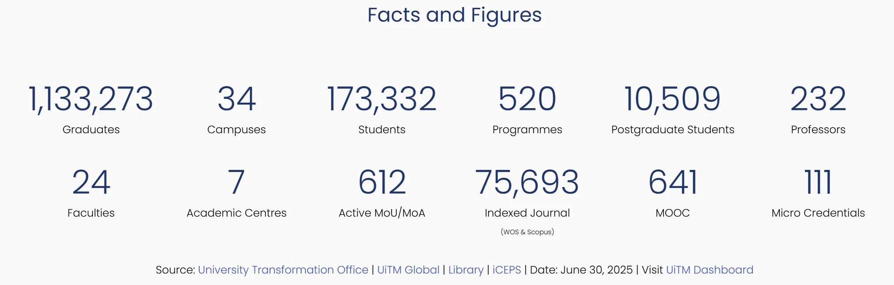

# Animated Facts and Figures



_Footer_ merupakan bahagian penutup kepada halaman laman web. _Footer_ mempunya maklumat seperti alamat universiti/kampus, nombor telefon, emel, pautan media sosial serta pautan-pautan lain yang perlu diberi keutamaan. Untuk mencipta _footer_ seperti diatas, ikuti langkah berikut:

<ol>
    <li>Nyah aktif Default Editor</li>
        <ol type="a">
            <li>System - Global Configuration</li>
            <li>Site - Default Editor - None (Sekiranya tidak tukar, TinyMCE Editor adalah WYSIWYG Editor dan kod HTML dan CSS tidak akan berfungsi)</li>
            <li>Save and Close</li>
        </ol>
    <li>Content - Site Module</li>
    <li>New - Custom</li>
    <li>Title - Facts</li>
    <li>Title - Hide</li>
    <li>Position - sidebar-right</li>
    <li>Salin dan tampal kod dibawah</li>
    <li>Save and Close</li>
</ol>

SP Page Builder:

<ol>
  <li>Menu - Component - SP Page Builder Pro - Pages</li>
  <li>Pilih halaman untuk papar Facts and Figures</li>
  <li>Add Elements - Joomla Module</li>
  <li>Module Settings - Type: Module</li>
  <li>Module Settings - Module: Facts (nama modul)</li>
  <li>Save</li>
</ol>

> Jangan lupa untuk pastikan anda memilih menu yang diperlukan untuk paparan modul ini di **Menu Assignment**

```html
<style>
        .number {
            font-size: 50px;
            line-height: 67px;
            font-weight: 300;
            text-align: center;
color: #20356B;
        }

        .number_text {
            margin-bottom: 2rem;
            text-align: center;
        }
    </style>
<div class="row" id="numbers-section">
        <div class="col-md-2">
            <div class="number" data-target="1133273">0</div>
            <div class="number_text">Graduates</div>
        </div>
        <div class="col-md-2">
            <div class="number" data-target="34">0</div>
            <div class="number_text">Campuses</div>
        </div>
        <div class="col-md-2">
            <div class="number" data-target="173332">0</div>
            <div class="number_text">Students</div>
        </div>
        <div class="col-md-2">
            <div class="number" data-target="520">0</div>
            <div class="number_text">Programmes</div>
        </div>
        <div class="col-md-2">
            <div class="number" data-target="10509">0</div>
            <div class="number_text">Postgraduate Students</div>
        </div>
        <div class="col-md-2">
            <div class="number" data-target="232">0</div>
            <div class="number_text">Professors</div>
        </div>

        <div class="col-md-2">
            <div class="number" data-target="24">0</div>
            <div class="number_text">Faculties</div>
        </div>
        <div class="col-md-2">
            <div class="number" data-target="7">0</div>
            <div class="number_text">Academic Centres</div>
        </div>
        <div class="col-md-2">
            <div class="number" data-target="612">0</div>
            <div class="number_text">Active MoU/MoA</div>
        </div>
        <div class="col-md-2">
            <div class="number" data-target="75693">0</div>
            <div class="number_text">Indexed Journal<br/><span style="font-size:10px;">(WOS & Scopus)<span></div>
        </div>
        <div class="col-md-2">
            <div class="number" data-target="641">0</div>
            <div class="number_text">MOOC</div>
        </div>
        <div class="col-md-2">
            <div class="number" data-target="111">0</div>
            <div class="number_text">Micro Credentials</div>
        </div>
    </div>
    <script>
        document.addEventListener("DOMContentLoaded", function() {
            let animated = false;

            function animateNumbers() {
                const numbers = document.querySelectorAll('.number');
                numbers.forEach(num => {
                    const target = +num.getAttribute('data-target');
                    const duration = 1500;
                    const start = 0;
                    const startTime = performance.now();

                    function animate(currentTime) {
                        const elapsed = currentTime - startTime;
                        const progress = Math.min(elapsed / duration, 1);
                        let value = Math.floor(progress * (target - start) + start);
                        if (target > 999) {
                            value = value.toLocaleString();
                        }
                        num.textContent = value;
                        if (progress < 1) {
                            requestAnimationFrame(animate);
                        } else {
                            num.textContent = target.toLocaleString();
                        }
                    }
                    requestAnimationFrame(animate);
                });
            }

            function isSectionVisible() {
                const section = document.getElementById('numbers-section');
                const rect = section.getBoundingClientRect();
                return (
                    rect.top < window.innerHeight && rect.bottom > 0
                );
            }

            function onScroll() {
                if (!animated && isSectionVisible()) {
                    animated = true;
                    animateNumbers();
                    window.removeEventListener('scroll', onScroll);
                }
            }

            window.addEventListener('scroll', onScroll);
            // In case already visible on load
            onScroll();
        });
    </script>

<link rel="preconnect" href="https://fonts.googleapis.com">
    <link rel="preconnect" href="https://fonts.gstatic.com" crossorigin>
    <link href="https://fonts.googleapis.com/css2?family=Yellowtail&display=swap" rel="stylesheet">
    <style>
        .freehand {
            font-family: "Yellowtail", cursive;
            font-weight: 400;
            font-style: normal;
            text-align: center;
            font-size: 2rem;
        }
    </style>

```
