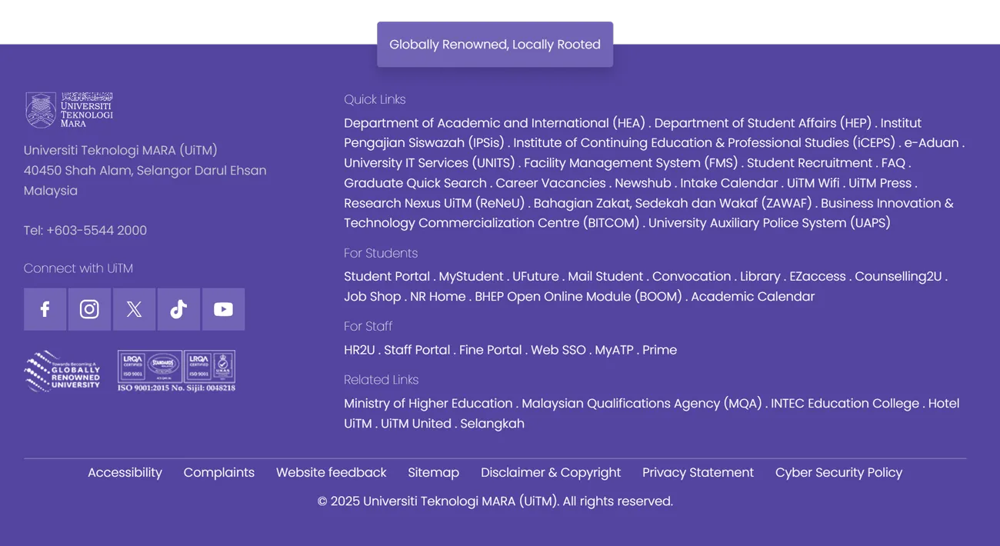

# Footer



_Footer_ merupakan bahagian penutup kepada halaman laman web. _Footer_ mempunya maklumat seperti alamat universiti/kampus, nombor telefon, emel, pautan media sosial serta pautan-pautan lain yang perlu diberi keutamaan. Untuk mencipta _footer_ seperti diatas, ikuti langkah berikut:

<ol>
    <li>Nyah aktif Default Editor</li>
        <ol type="a">
            <li>System - Global Configuration</li>
            <li>Site - Default Editor - None (Sekiranya tidak tukar, TinyMCE Editor adalah WYSIWYG Editor dan kod HTML dan CSS tidak akan berfungsi)</li>
            <li>Save and Close</li>
        </ol>
    <li>Content - Site Module</li>
    <li>New - Custom</li>
    <li>Title - Footer</li>
    <li>Title - Hide</li>
    <li>Position - footer2 (bergantung kepada setting modul position templat. Semak di menu templat)</li>
    <li>Salin dan tampal kod dibawah</li>
    <li>Save and Close</li>
</ol>

> Jangan lupa untuk pastikan anda memilih menu yang diperlukan untuk paparan modul ini di **Menu Assignment**

```html
<style>
  .sp-module ul {
    flex-direction: row;
  }
  .sp-module ul > li {
    display: block;
    border-bottom: 0px solid #e8e8e8;
    -webkit-transition: 300ms;
    transition: 300ms;
  }
  .sp-module ul > li > a:before {
    font-family: "Font Awesome 5 Free";
    content: "\f105";
    margin-right: 8px;
    font-weight: 600;
    display: none;
  }
  .pf2-footer {
    background-color: #5445a0;
    color: white;
    padding: 10px 0;
    width: 100%;
  }

  .pf2-footer-bottom {
    background-color: #ffbe11;
    bottom: 0;
    width: 100%;
    min-height: 5px;
  }

  .pf2-footer-social-links {
    padding: 0;
    margin: 0;
  }

  .pf2-footer-social-links li {
    list-style: none;
    margin-bottom: 10px;
    width: 56px;
    height: 56px;
    display: flex;
    text-align: center;
    margin-right: 3px;
    background-color: #7164b5ff;
  }

  .pf2-footer-social-links li:hover {
    list-style: none;
    margin-bottom: 10px;
    width: 56px;
    height: 56px;
    display: flex;
    text-align: center;
    margin-right: 5px;
    background-color: #ffffff;
    color: #5445a0;
  }

  .pf2-footer-text-gray {
    color: #caccceff;
  }

  .pf2-footer-heading {
    position: relative;
    margin-bottom: 2rem;
    background: #7164b5ff;
    color: #ffffff;
    min-height: 50px;
    margin-top: -98px; /* -145px */
    width: fit-content;
    margin-left: auto;
    margin-right: auto;
    z-index: 10;
  }

  /* Quick links */

  .pf2-footer-quick-links li {
    display: inline-flex;
  }

  .pf2-footer-quick-links li:not(:last-child)::after {
    content: " | ";
    padding: 0 0.25rem;
  }

  a.pf2-footer-quick-links:link {
    color: #caccceff;
    text-decoration: none;
  }

  a.pf2-footer-quick-links:visited {
    color: #caccceff;
    text-decoration: none;
  }

  a.pf2-footer-quick-links:hover {
    color: #ffbe11;
  }

  /* Subsection */
  .pf2-footer-sub-section {
    padding: 0;
    margin: 0;
    flex-wrap: wrap;
    gap: 0.25rem 0.75rem;
  }

  .pf2-footer-sub-section li {
    list-style: none;
    margin-bottom: 6px;
    display: flex;
    text-align: center;
  }

  @media (max-width: 575.98px) {
    .pf2-footer-sub-section {
      display: grid !important;
      grid-template-columns: repeat(auto-fit, minmax(110px, 1fr));
      gap: 0.5rem 0.75rem;
      justify-content: center;
    }

    .pf2-footer-sub-section li {
      margin: 0;
      padding: 0.35rem 0.5rem;
      border: 0px solid rgba(255, 255, 255, 0.15);
      border-radius: 4px;
      min-height: 38px;
    }
  }
</style>

<div class="container-fluid pf2-footer">
  <div class="container py-4">
    <div class="card pf2-footer-heading rounded text-center shadow">
      <div class="card-body">Globally Renowned, Locally Rooted</div>
    </div>
    <div class="row">
      <div class="col-md-4">
        
        <div class="pf2-footer-text-gray">
          Universiti Teknologi MARA (UiTM)<br />
          40450 Shah Alam, Selangor Darul Ehsan<br />
          Malaysia<br /><br />
          Tel: +603-5544 2000<br /><br />
        </div>
        <h6 class="mb-3">Connect with UiTM</h6>
        <div>
          <ul
            class="list-unstyled d-flex align-items-center pf2-footer-social-links"
          >
            <li class="d-flex justify-content-center align-items-center">
              <a
                href="https://www.facebook.com/uitmrasmi"
                target="_blank"
                style="color: inherit; text-decoration: none; display: flex; justify-content: center; align-items: center; width: 100%; height: 100%;"
              >
                <svg
                  width="30"
                  height="30"
                  viewBox="0 0 32 32"
                  fill="currentColor"
                >
                  <path
                    d="M21.95 5.005l-3.306-.004c-3.206 0-5.277 2.124-5.277 5.415v2.495H10.05v4.515h3.317l-.004 9.575h4.641l.004-9.575h3.806l-.003-4.514h-3.803v-2.117c0-1.018.241-1.533 1.566-1.533l2.366-.001.10-4.256z"
                  />
                </svg>
              </a>
            </li>
            <li class="d-flex justify-content-center align-items-center">
              <a
                href="https://www.instagram.com/uitm.official/"
                target="_blank"
                style="color: inherit; text-decoration: none; display: flex; justify-content: center; align-items: center; width: 100%; height: 100%;"
              >
                <svg
                  width="25"
                  height="25"
                  viewBox="0 0 32 32"
                  fill="currentColor"
                >
                  <path
                    d="M16 2.88c4.28 0 4.784.02 6.467.092 1.56.072 2.404.332 2.967.552.748.29 1.28.636 1.84 1.196.56.56.906 1.092 1.196 1.84.22.563.48 1.407.552 2.967.072 1.683.092 2.187.092 6.467s-.02 4.784-.092 6.467c-.072 1.56-.332 2.404-.552 2.967-.29.748-.636 1.28-1.196 1.84-.56.56-1.092.906-1.84 1.196-.563.22-1.407.48-2.967.552-1.683.072-2.187.092-6.467.092s-4.784-.02-6.467-.092c-1.56-.072-2.404-.332-2.967-.552-.748-.29-1.28-.636-1.84-1.196-.56-.56-.906-1.092-1.196-1.84-.22-.563-.48-1.407-.552-2.967C2.9 20.784 2.88 20.28 2.88 16s.02-4.784.092-6.467c.072-1.56.332-2.404.552-2.967.29-.748.636-1.28 1.196-1.84.56-.56 1.092-.906 1.84-1.196.563-.22 1.407-.48 2.967-.552C11.216 2.9 11.72 2.88 16 2.88M16 0C11.656 0 11.108.02 9.404.096 7.708.172 6.536.444 5.52.84 4.468 1.252 3.572 1.82 2.68 2.68 1.82 3.572 1.252 4.468.84 5.52.444 6.536.172 7.708.096 9.404.02 11.108 0 11.656 0 16s.02 4.892.096 6.596c.076 1.696.348 2.868.744 3.884.412 1.052.98 1.948 1.84 2.84.892.86 1.788 1.428 2.84 1.84 1.016.396 2.188.668 3.884.744C11.108 31.98 11.656 32 16 32s4.892-.02 6.596-.096c1.696-.076 2.868-.348 3.884-.744 1.052-.412 1.948-.98 2.84-1.84.86-.892 1.428-1.788 1.84-2.84.396-1.016.668-2.188.744-3.884C31.98 20.892 32 20.344 32 16s-.02-4.892-.096-6.596c-.076-1.696-.348-2.868-.744-3.884-.412-1.052-.98-1.948-1.84-2.84-.892-.86-1.788-1.428-2.84-1.84-1.016-.396-2.188-.668-3.884-.744C20.892.02 20.344 0 16 0zm0 7.784c-4.536 0-8.216 3.68-8.216 8.216s3.68 8.216 8.216 8.216 8.216-3.68 8.216-8.216-3.68-8.216-8.216-8.216zm0 13.544c-2.944 0-5.328-2.384-5.328-5.328s2.384-5.328 5.328-5.328 5.328 2.384 5.328 5.328-2.384 5.328-5.328 5.328zm10.444-13.848c0 1.06-.86 1.92-1.92 1.92s-1.92-.86-1.92-1.92.86-1.92 1.92-1.92 1.92.86 1.92 1.92z"
                  />
                </svg>
              </a>
            </li>
            <li class="d-flex justify-content-center align-items-center">
              <a
                href="https://x.com/uitmofficial"
                target="_blank"
                style="color: inherit; text-decoration: none; display: flex; justify-content: center; align-items: center; width: 100%; height: 100%;"
              >
                <svg
                  width="25"
                  height="25"
                  viewBox="0 0 32 32"
                  fill="currentColor"
                >
                  <path
                    d="M18.42 14.009L27.891 3h-2.244l-8.224 9.559L10.855 3H3.28l9.932 14.455L3.28 29h2.244l8.684-10.095L21.145 29h7.575l-10.301-14.991zm-3.074 3.573l-1.006-1.439L6.333 4.69h3.447l6.462 9.243 1.006 1.439 8.4 12.015h-3.447l-6.854-9.805z"
                  />
                </svg>
              </a>
            </li>
            <li class="d-flex justify-content-center align-items-center">
              <a
                href="https://www.tiktok.com/@uitm_channel?lang=en"
                target="_blank"
                style="color: inherit; text-decoration: none; display: flex; justify-content: center; align-items: center; width: 100%; height: 100%;"
              >
                <svg
                  width="25"
                  height="25"
                  viewBox="0 0 32 32"
                  fill="currentColor"
                >
                  <path
                    d="M16.708 0.027c1.745-0.027 3.48-0.011 5.213-0.027 0.105 2.041 0.839 4.12 2.333 5.563 1.491 1.479 3.6 2.156 5.652 2.385v5.369c-1.923-0.063-3.855-0.463-5.6-1.291-0.76-0.344-1.468-0.787-2.161-1.24-0.009 3.896 0.016 7.787-0.025 11.667-0.104 1.864-0.719 3.719-1.803 5.255-1.744 2.557-4.771 4.224-7.88 4.276-1.907 0.109-3.812-0.411-5.437-1.369-2.693-1.588-4.588-4.495-4.864-7.615-0.032-0.667-0.043-1.333-0.016-1.984 0.24-2.537 1.495-4.964 3.443-6.615 2.208-1.923 5.301-2.839 8.197-2.297 0.027 1.975-0.052 3.948-0.052 5.923-1.323-0.428-2.869-0.308-4.025 0.573-0.901 0.667-1.324 1.791-1.344 2.927-0.036 0.807 0.319 1.604 0.915 2.083 0.508 0.443 1.22 0.708 1.923 0.605 1.521-0.2 2.84-1.281 3.396-2.735 0.233-0.679 0.307-1.411 0.307-2.135 0.025-5.197-0.011-10.395 0.020-15.593z"
                  />
                </svg>
              </a>
            </li>
            <li class="d-flex justify-content-center align-items-center">
              <a
                href="youtube.com/@uitmchannel"
                target="_blank"
                style="color: inherit; text-decoration: none; display: flex; justify-content: center; align-items: center; width: 100%; height: 100%;"
              >
                <svg
                  width="25"
                  height="25"
                  viewBox="0 0 32 32"
                  fill="currentColor"
                >
                  <path
                    d="M31.331 8.248c-0.369-1.417-1.455-2.532-2.839-2.913-2.501-0.669-12.534-0.669-12.534-0.669s-10.033 0-12.534 0.669c-1.384 0.381-2.47 1.496-2.839 2.913-0.661 2.563-0.661 7.917-0.661 7.917s0 5.354 0.661 7.917c0.369 1.417 1.455 2.532 2.839 2.913 2.501 0.669 12.534 0.669 12.534 0.669s10.033 0 12.534-0.669c1.384-0.381 2.47-1.496 2.839-2.913 0.661-2.563 0.661-7.917 0.661-7.917s0-5.354-0.661-7.917zM12.812 20.956v-9.912l8.375 4.956z"
                  />
                </svg>
              </a>
            </li>
          </ul>
        </div>

        <div class="row row-cols-auto mt-3">
          <div class="col">
            
          </div>
          <div class="col">
            
          </div>
        </div>
      </div>
      <div class="col-md-8">
        <div class="mb-3">
          <h6>Quick Links</h6>
          <a
            href="https://hea.uitm.edu.my/"
            target="_blank"
            class="pf2-footer-quick-links"
            >Department of Academic and International (HEA)</a
          >
          .
          <a
            href="https://hep.uitm.edu.my/"
            target="_blank"
            class="pf2-footer-quick-links"
            >Department of Student Affairs (HEP)</a
          >
          .
          <a
            href="https://ipsis.uitm.edu.my/"
            target="_blank"
            class="pf2-footer-quick-links"
            >Institut Pengajian Siswazah (IPSis)</a
          >
          .
          <a
            href="https://iceps.uitm.edu.my/"
            target="_blank"
            class="pf2-footer-quick-links"
            >Institute of Continuing Education &amp; Professional Studies
            (iCEPS)</a
          >
          .
          <a
            href="https://aduan.uitm.edu.my/"
            target="_blank"
            class="pf2-footer-quick-links"
            >e-Aduan</a
          >
          .
          <a
            href="https://units.uitm.edu.my/"
            target="_blank"
            class="pf2-footer-quick-links"
            >University IT Services (UNITS)</a
          >
          .
          <a
            href="https://fms.uitm.edu.my/"
            target="_blank"
            class="pf2-footer-quick-links"
            >Facility Management System (FMS)</a
          >
          .
          <a
            href="https://pengambilan.uitm.edu.my/"
            target="_blank"
            class="pf2-footer-quick-links"
            >Student Recruitment</a
          >
          .
          <a href="en/others/faq" target="_blank" class="pf2-footer-quick-links"
            >FAQ</a
          >
          .
          <a
            href="https://graduan.uitm.edu.my/"
            target="_blank"
            class="pf2-footer-quick-links"
            >Graduate Quick Search</a
          >
          .
          <a
            href="en/discover-uitm/career-vacancies"
            target="_blank"
            class="pf2-footer-quick-links"
            >Career Vacancies</a
          >
          .
          <a
            href="https://news.uitm.edu.my/"
            target="_blank"
            class="pf2-footer-quick-links"
            >Newshub</a
          >
          .
          <a
            href="https://pengambilan.uitm.edu.my/index.php/kalendar"
            target="_blank"
            class="pf2-footer-quick-links"
            >Intake Calendar</a
          >
          .
          <a
            href="https://wifi.uitm.edu.my/"
            target="_blank"
            class="pf2-footer-quick-links"
            >UiTM Wifi</a
          >
          .
          <a
            href="https://penerbit.uitm.edu.my/"
            target="_blank"
            class="pf2-footer-quick-links"
            >UiTM Press</a
          >
          .
          <a
            href="https://reneu.uitm.edu.my/"
            target="_blank"
            class="pf2-footer-quick-links"
            >Research Nexus UiTM (ReNeU)</a
          >
          .
          <a
            href="https://zawaf.uitm.edu.my/"
            target="_blank"
            class="pf2-footer-quick-links"
            >Bahagian Zakat, Sedekah dan Wakaf (ZAWAF)</a
          >
          .
          <a
            href="https://bitcom.uitm.edu.my/"
            target="_blank"
            class="pf2-footer-quick-links"
            >Business Innovation & Technology Commercialization Centre
            (BITCOM)</a
          >
          .
          <a
            href="https://uaps.uitm.edu.my/"
            target="_blank"
            class="pf2-footer-quick-links"
            >University Auxiliary Police System (UAPS)</a
          >
        </div>

        <div class="mb-3">
          <h6>For Students</h6>
          <a
            href="https://istudent.uitm.edu.my/"
            target="_blank"
            class="pf2-footer-quick-links"
            >Student Portal</a
          >
          .
          <a
            href="https://mystudent.uitm.edu.my/"
            target="_blank"
            class="pf2-footer-quick-links"
            >MyStudent</a
          >
          .
          <a
            href="https://ufuture.uitm.edu.my/"
            target="_blank"
            class="pf2-footer-quick-links"
            >UFuture</a
          >
          .
          <a
            href="https://mail.uitm.edu.my/"
            target="_blank"
            class="pf2-footer-quick-links"
            >Mail Student</a
          >
          .
          <a
            href="https://konvokesyen.uitm.edu.my/"
            target="_blank"
            class="pf2-footer-quick-links"
            >Convocation</a
          >
          .
          <a
            href="https://library.uitm.edu.my/"
            target="_blank"
            class="pf2-footer-quick-links"
            >Library</a
          >
          .
          <a
            href="https://ezaccess.remotexs.co/user/login"
            target="_blank"
            class="pf2-footer-quick-links"
            >EZaccess</a
          >
          .
          <a
            href="https://counselling2u.uitm.edu.my/"
            target="_blank"
            class="pf2-footer-quick-links"
            >Counselling2U</a
          >
          .
          <a
            href="https://jobshop.uitm.edu.my/"
            target="_blank"
            class="pf2-footer-quick-links"
            >Job Shop</a
          >
          .
          <a
            href="https://nrhome.uitm.edu.my/"
            target="_blank"
            class="pf2-footer-quick-links"
            >NR Home</a
          >
          .
          <a href="https://ufuture.uitm.edu.my/boom/"
            >BHEP Open Online Module (BOOM)</a
          >
          .
          <a
            href="https://hea.uitm.edu.my/index.php/calendars/academic-calendar"
            target="_blank"
            class="pf2-footer-quick-links"
            >Academic Calendar</a
          >
        </div>

        <div class="mb-3">
          <h6>For Staff</h6>
          <a
            href="https://hr2u.uitm.edu.my/"
            target="_blank"
            class="pf2-footer-quick-links"
            >HR2U</a
          >
          .
          <a
            href="https://aplikasi.uitm.edu.my/Portal_I-Staf/skrin/"
            target="_blank"
            class="pf2-footer-quick-links"
            >Staff Portal</a
          >
          .
          <a
            href="https://myfinancialsso.uitm.edu.my/fineportal/login"
            target="_blank"
            class="pf2-footer-quick-links"
            >Fine Portal</a
          >
          .
          <a
            href="https://sso.uitm.edu.my/nidp/app/login"
            target="_blank"
            class="pf2-footer-quick-links"
            >Web SSO</a
          >
          .
          <a
            href="https://myatp.uitm.edu.my/"
            target="_blank"
            class="pf2-footer-quick-links"
            >MyATP</a
          >
          .
          <a
            href="https://prime.uitm.edu.my/"
            target="_blank"
            class="pf2-footer-quick-links"
            >Prime</a
          >
        </div>

        <div class="mb-3">
          <h6>Related Links</h6>
          <a
            href="https://www.mohe.gov.my/"
            target="_blank"
            class="pf2-footer-quick-links"
            >Ministry of Higher Education</a
          >
          .
          <a
            href="https://www.mqa.gov.my/"
            target="_blank"
            class="pf2-footer-quick-links"
            >Malaysian Qualifications Agency (MQA)</a
          >
          .
          <a
            href="https://www.intec.edu.my/"
            target="_blank"
            class="pf2-footer-quick-links"
            >INTEC Education College</a
          >
          .
          <a
            href="https://hoteluitm.com/"
            target="_blank"
            class="pf2-footer-quick-links"
            >Hotel UiTM</a
          >
          .
          <a
            href="https://www.facebook.com/uitmfclions"
            target="_blank"
            class="pf2-footer-quick-links"
            >UiTM United</a
          >
          .
          <a
            href="https://selangkah.uitm.edu.my/"
            target="_blank"
            class="pf2-footer-quick-links"
            >Selangkah</a
          >
        </div>
      </div>
    </div>

    <hr />
    <ul
      class="list-unstyled d-flex flex-sm-row align-items-center justify-content-center pf2-footer-sub-section text-center w-100"
    >
      <li class="px-2">
        <a
          href="en/others/accessibility-statement"
          target="_blank"
          class="pf2-footer-quick-links"
          >Accessibility</a
        >
      </li>
      <li class="px-2">
        <a
          href="https://aduan.uitm.edu.my/"
          target="_blank"
          class="pf2-footer-quick-links"
          >Complaints</a
        >
      </li>
      <li class="px-2">
        <a href="#" target="_blank" class="pf2-footer-quick-links"
          >Website feedback</a
        >
      </li>
      <li class="px-2">
        <a
          href="en/others/sitemap"
          target="_blank"
          class="pf2-footer-quick-links"
          >Sitemap</a
        >
      </li>
      <li class="px-2">
        <a
          href="https://www.uitm.edu.my/index.php/disclaimer-copyright"
          target="_blank"
          class="pf2-footer-quick-links"
          >Disclaimer &amp; Copyright</a
        >
      </li>
      <li class="px-2">
        <a
          href="https://www.uitm.edu.my/index.php/privacy-statement"
          target="_blank"
          class="pf2-footer-quick-links"
          >Privacy Statement</a
        >
      </li>
      <li class="px-2">
        <a
          href="https://digital.uitm.edu.my/images/downloads/info_keeper/Pekeliling/PolisiKeselamatanSiberUiTM.pdf"
          target="_blank"
          class="pf2-footer-quick-links"
          >Cyber Security Policy</a
        >
      </li>
    </ul>

    <div class="text-center mt-3">
      © 2025 Universiti Teknologi MARA (UiTM). All rights reserved.
    </div>
  </div>
</div>
```
