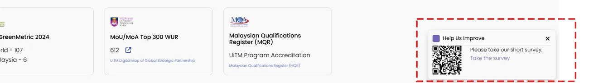

# NewsHub Feed



_Toast Box_ ini boleh digunakan sebagai visual promosi kepada sesuatu peristiwa. _Toast Box_ ini akan terapung dibahagian bawah kanan laman web. Untuk mencipta _Toast Box_ seperti diatas, ikuti langkah berikut:

<ol>
    <li>Nyah aktif Default Editor</li>
        <ol type="a">
            <li>System - Global Configuration</li>
            <li>Site - Default Editor - None (Sekiranya tidak tukar, TinyMCE Editor adalah WYSIWYG Editor dan kod HTML dan CSS tidak akan berfungsi)</li>
            <li>Save and Close</li>
        </ol>
    <li>Content - Site Module</li>
    <li>New - Custom</li>
    <li>Title - Toast</li>
    <li>Title - Hide</li>
    <li>Position - footer2</li>
    <li>Salin dan tampal kod dibawah</li>
    <li>Save and Close</li>
</ol>

> Jangan lupa untuk pastikan anda memilih menu yang diperlukan untuk paparan modul ini di **Menu Assignment**

```html
<style>
  .uitm-fixed-note {
    position: fixed;
    bottom: 1rem;
    right: 1rem;
    width: fit-content;
    z-index: 2147483647;
    background-color: #f9f9f9;
    color: #000000;
    border: 1px solid rgba(0, 0, 0, 0.1);
    border-radius: 0.5rem;
    box-shadow: 0 0.5rem 1rem rgba(0, 0, 0, 0.15);
    padding: 0.75rem;
    pointer-events: auto;
    font-size: 0.875rem;
  }

  .uitm-notification-header {
    display: flex;
    align-items: center;
    padding-bottom: 0.5rem;
    border-bottom: 1px solid rgba(0, 0, 0, 0.1);
    font-weight: 400;
  }

  a.uitm_notification:link {
    color: #7164b5 !important;
    text-decoration: none;
  }

  a.uitm_notification:visited {
    color: #7164b5 !important;
    text-decoration: none;
  }

  a.uitm_notification:hover {
    color: #7164b5 !important;
    text-decoration: underline;
  }
</style>

<div
  id="surveyNote"
  class="uitm-fixed-note"
  role="region"
  aria-label="Bottom-right message"
  style="display:none;"
>
  <div class="uitm-notification-header">
    Help Us Improve
    <button
      id="surveyClose"
      type="button"
      aria-label="Close notification"
      style="position:absolute;top:.5rem;right:.5rem;border:none;background:transparent;font-size:1.5rem;line-height:1.3;cursor:pointer;"
    >
      &times;
    </button>
  </div>

  <div class="row">
    <div class="col-auto">
      <div style="padding-right:1.5rem;">Please take our short survey.</div>
      <a
        id="surveyLink"
        class="uitm_notification"
        href="#your-survey-url"
        target="_blank"
        rel="noopener"
        >Take the survey</a
      >
    </div>
  </div>
</div>
```
