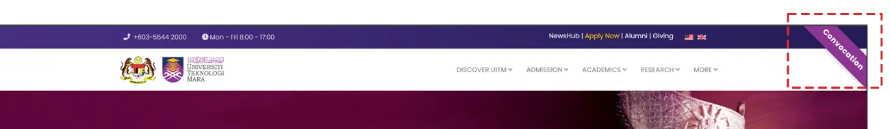

# Ribbon (Top-Right)



Ribbon ini boleh digunakan sebagai visual promosi kepada sesuatu peristiwa. Untuk mencipta modul ribbon seperti diatas, ikuti langkah berikut:

<ol>
    <li>Disable Default Editor</li>
        <ol type="a">
            <li>System - Global Configuration</li>
            <li>Site - Default Editor - None (Sekiranya tidak tukar, TinyMCE Editor adalah WYSIWYG Editor dan kod HTML dan CSS ribbon tidak akan berfungsi)</li>
            <li>Save and Close</li>
        </ol>
    <li>Content - Site Module</li>
    <li>New - Custom</li>
    <li>Title - Ribbon</li>
    <li>Title - Hide</li>
    <li>Position - Debug (Position debug akan wujud disemua halaman)</li>
    <li>Salin dan tampal kod dibawah</li>
    <li>Save and Close</li>
</ol>

> Jangan lupa untuk pastikan anda memilih menu yang diperlukan untuk paparan modul ini di **Menu Assignment**

```html
<style>
  .corner-ribbon {
    width: 200px;
    background: #8d3594;
    position: fixed;
    top: 25px;
    right: -50px;
    text-align: center;
    line-height: 50px;
    letter-spacing: 1px;
    color: #fff;
    font-weight: bold;
    transform: rotate(45deg);
    box-shadow: 0 0 10px rgba(0, 0, 0, 0.3);
    z-index: 9999;
  }

  .corner-ribbon a {
    display: block;
    color: #fff;
    text-decoration: none;
  }

  .corner-ribbon.top-right {
    top: 25px;
    right: -50px;
  }
</style>

<div class="corner-ribbon top-right d-none d-md-block">
  <a href="https://konvokesyen.uitm.edu.my/" target="_blank">Convocation</a>
</div>
```
