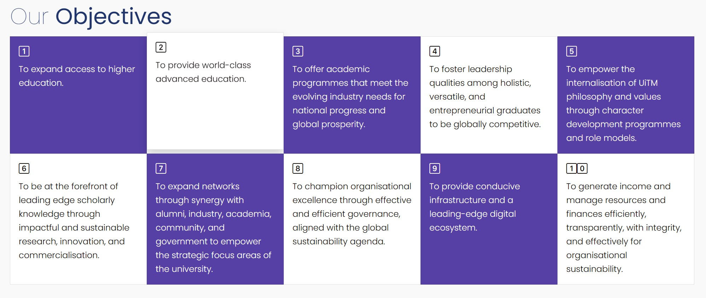

# Tiles



_Tiles_ merupakan kotak-kotak yang disusun untuk memaparkan kandungan dilaman web menggunakan konsep column dan row di dalam Bootstrap. Untuk mencipta _Tiles_ seperti diatas, ikuti langkah berikut:

<ol>
    <li>Nyah aktif Default Editor</li>
        <ol type="a">
            <li>System - Global Configuration</li>
            <li>Site - Default Editor - None (Sekiranya tidak tukar, TinyMCE Editor adalah WYSIWYG Editor dan kod HTML dan CSS tidak akan berfungsi)</li>
            <li>Save and Close</li>
        </ol>
    <li>Components - SP Page Builder Pro - Pages</li>
    <li>Pilih page anda</li>
    <li>Add Element - Raw HTML</li>
    <li>Masuk kan kod dibawah dibahagian HTML Code</li>
    <li>Save</li>
</ol>

```html
<link
  rel="stylesheet"
  href="https://cdn.jsdelivr.net/npm/bootstrap-icons@1.13.1/font/bootstrap-icons.min.css"
/>
<style>
  .card {
    transition: transform 0.3s ease, box-shadow 0.3s ease;
    border-radius: 0px;
  }

  .bg-purple {
    background-color: #5640a6;
    color: white;
  }

  .card:hover {
    transform: translateY(-10px);
    box-shadow: 0 10px 20px rgba(0, 0, 0, 0.2);
  }
</style>
<div class="row g-0">
  <div class="col-12 col-md">
    <div class="card h-100 bg-purple">
      <div class="card-body">
        <h5 class="card-title"><i class="bi bi-1-square"></i></h5>
        <p class="card-text">To expand access to higher education.</p>
      </div>
    </div>
  </div>
  <div class="col-12 col-md">
    <div class="card h-100">
      <div class="card-body">
        <h5 class="card-title"><i class="bi bi-2-square"></i></h5>
        <p class="card-text">To provide world-class advanced education.</p>
      </div>
    </div>
  </div>
  <div class="col-12 col-md">
    <div class="card h-100 bg-purple">
      <div class="card-body">
        <h5 class="card-title"><i class="bi bi-3-square"></i></h5>
        <p class="card-text">
          To offer academic programmes that meet the evolving industry needs for
          national progress and global prosperity.
        </p>
      </div>
    </div>
  </div>
  <div class="col-12 col-md">
    <div class="card h-100">
      <div class="card-body">
        <h5 class="card-title"><i class="bi bi-4-square"></i></h5>
        <p class="card-text">
          To foster leadership qualities among holistic, versatile, and
          entrepreneurial graduates to be globally competitive.
        </p>
      </div>
    </div>
  </div>
  <div class="col-12 col-md">
    <div class="card h-100 bg-purple">
      <div class="card-body">
        <h5 class="card-title"><i class="bi bi-5-square"></i></h5>
        <p class="card-text">
          To empower the internalisation of UiTM philosophy and values through
          character development programmes and role models.
        </p>
      </div>
    </div>
  </div>
</div>
<div class="row g-0">
  <div class="col-12 col-md">
    <div class="card h-100">
      <div class="card-body">
        <h5 class="card-title"><i class="bi bi-6-square"></i></h5>
        <p class="card-text">
          To be at the forefront of leading edge scholarly knowledge through
          impactful and sustainable research, innovation, and commercialisation.
        </p>
      </div>
    </div>
  </div>
  <div class="col-12 col-md">
    <div class="card h-100 bg-purple">
      <div class="card-body">
        <h5 class="card-title"><i class="bi bi-7-square"></i></h5>
        <p class="card-text">
          To expand networks through synergy with alumni, industry, academia,
          community, and government to empower the strategic focus areas of the
          university.
        </p>
      </div>
    </div>
  </div>
  <div class="col-12 col-md">
    <div class="card h-100">
      <div class="card-body">
        <h5 class="card-title"><i class="bi bi-8-square"></i></h5>
        <p class="card-text">
          To champion organisational excellence through effective and efficient
          governance, aligned with the global sustainability agenda.
        </p>
      </div>
    </div>
  </div>
  <div class="col-12 col-md">
    <div class="card h-100 bg-purple">
      <div class="card-body">
        <h5 class="card-title"><i class="bi bi-9-square"></i></h5>
        <p class="card-text">
          To provide conducive infrastructure and a leading-edge digital
          ecosystem.
        </p>
      </div>
    </div>
  </div>
  <div class="col-12 col-md">
    <div class="card h-100">
      <div class="card-body">
        <h5 class="card-title">
          <i class="bi bi-1-square"></i><i class="bi bi-0-square"></i>
        </h5>
        <p class="card-text">
          To generate income and manage resources and finances efficiently,
          transparently, with integrity, and effectively for organisational
          sustainability.
        </p>
      </div>
    </div>
  </div>
</div>
```
